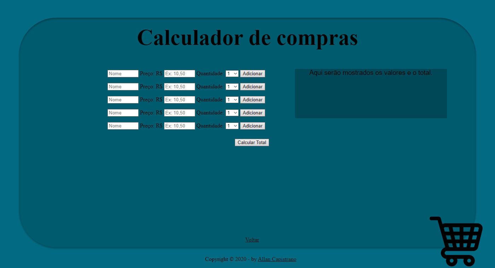

# Calculador-de-Compras

  <h4>Página principal.</h4>
  

  

  <h4>Página de cálculos (exemplo para 5 pessoas).</h4>
  

------------

## 📚 Descrição ##
Esta é uma aplicação web criada para calcular separadamente compras de diferentes pessoas em uma mesma nota fiscal.  
Foi desenvolvida com o intuito auxiliar minha mãe no cálculo correto da feira do mês, já que ela faz as compras para várias pessoas, e estava complicado saber o valor correto das compras de cada pessoa separadamente, pois vem tudo junto na nota fiscal. Então aproveitei para por em prática alguns conhecimentos que adquiri, principalmente de PHP, em prática.

------------

## 📌 Autor ##
- Allan Capistrano: [Github](https://github.com/AllanCapistrano) - [Linkedin](https://www.linkedin.com/in/allancapistrano/) - [E-mail](https://mail.google.com/mail/u/0/?view=cm&fs=1&tf=1&source=mailto&to=asantos@ecomp.uefs.br)

------------

## ⚖️ Licença ##
[MIT License (MIT)](https://github.com/AllanCapistrano/Calculador-de-Compras/blob/master/LICENSE)
