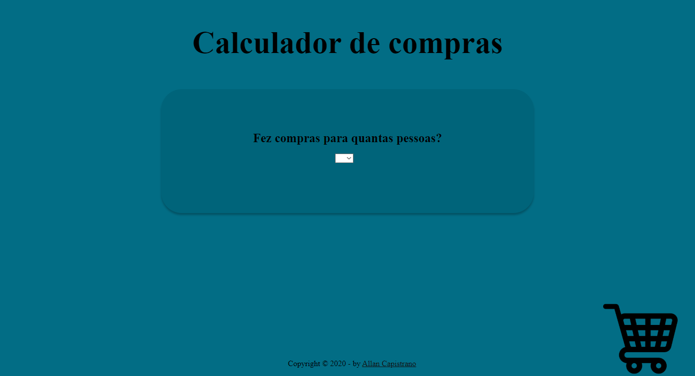

# Calculardor-de-Compras

  

## Descrição ##

###### Aplicação web criada para calcular compras. ###### 

Foi desenvolvida com o intuito auxiliar minha mãe no cálculo correto da feira do mês, já que ela faz as compras para várias pessoas, e estava complicado saber o valor correto das compras de cada pessoa separadamente, pois vem tudo junto na nota fiscal. Então aproveitei para por em prática alguns conhecimentos que adquiri, principalmente de PHP, em prática.
